# Cap Hashcat Web — Implementation Plan

A cross-platform web application that automates WiFi capture file (.cap/.pcap/.pcapng) cracking using hashcat, with GPU auto-detection, automatic file conversion, dictionary management, and a premium modern UI.

> [!IMPORTANT]
> This is a **security educational tool** for MCA coursework. It will be uploaded to GitHub and used for authorized WiFi security auditing on the user's own network.

---

## User Review Required

> [!WARNING]
> **Cap Conversion on Windows**: `hcxpcapngtool` (the standard tool for .cap → .hc22000 conversion) is **Linux-only**. For Windows support, we have two strategies:
> 1. **Primary**: Bundle a Python-based converter that parses EAPOL handshakes directly from pcap files (no external dependency)
> 2. **Fallback**: Detect if `hcxpcapngtool` is available (Linux/WSL) and use it when present
> 
> This means the Python converter handles the common case, while native `hcxpcapngtool` is used when available for maximum compatibility.

> [!IMPORTANT]
> **hashcat must be pre-installed** by the user. The setup scripts will check for it and guide installation if missing, but we won't auto-install hashcat itself (it requires GPU driver setup which varies per system).

---

## Open Questions

> [!IMPORTANT]
> 1. **Authentication**: Should the web app require login/password, or is it meant for local-only use (localhost binding)? I'm planning **localhost-only with optional basic auth** for safety.
> 2. **Multiple simultaneous sessions**: Should users be able to run multiple hashcat jobs at once, or one at a time? Planning **single active job with queue** for simplicity and GPU resource management.

---

## Architecture Overview

```mermaid
graph TB
    subgraph Frontend ["Frontend (Vite + Vanilla JS)"]
        UI["Modern Dark UI"]
        DnD["Drag & Drop Zone"]
        Monitor["Real-time Monitor"]
        DictMgr["Dictionary Manager"]
        GPUPanel["GPU Info Panel"]
    end
    
    subgraph Backend ["Backend (Node.js + Express)"]
        API["REST API"]
        WS["WebSocket Server"]
        Conv["Cap Converter Engine"]
        GPU["GPU Detector"]
        HC["Hashcat Process Manager"]
        Dict["Dictionary Downloader"]
    end
    
    subgraph External ["External Tools"]
        Hashcat["hashcat binary"]
        HCX["hcxpcapngtool (Linux)"]
    end
    
    UI --> API
    Monitor --> WS
    API --> Conv
    API --> GPU
    API --> HC
    API --> Dict
    HC --> Hashcat
    Conv --> HCX
    WS --> HC
```



## Tech Stack

| Layer | Technology | Reason |
|-------|-----------|--------|
| **Frontend** | Vite + Vanilla JS + CSS | Fast, modern, no framework overhead |
| **Backend** | Node.js + Express | Cross-platform, excellent process management |
| **WebSocket** | `ws` library | Real-time hashcat status streaming |
| **Cap Conversion** | Python script (bundled) + hcxpcapngtool fallback | Cross-platform .cap → .hc22000 |
| **GPU Detection** | `systeminformation` npm + `nvidia-smi` / `wmic` | Cross-platform hardware detection |
| **Process Mgmt** | Node.js `child_process` | Spawn/monitor/kill hashcat |
| **File Upload** | `multer` | Robust file upload handling |

---

## Proposed Changes

### 1. Project Setup & Configuration

#### [NEW] [package.json](file:///c:/Users/Ayush/Desktop/hashcat-gui/package.json)
- Node.js project with Express, ws, multer, systeminformation, uuid dependencies
- Scripts: `dev`, `build`, `start`

#### [NEW] [.gitignore](file:///c:/Users/Ayush/Desktop/hashcat-gui/.gitignore)
- Ignore node_modules, uploads, dictionaries, .env, sessions

#### [NEW] [README.md](file:///c:/Users/Ayush/Desktop/hashcat-gui/README.md)
- Project description, features, installation, usage, screenshots, license (MIT)
- Educational disclaimer

---

### 2. One-Click Setup Scripts

#### [NEW] [start.bat](file:///c:/Users/Ayush/Desktop/hashcat-gui/start.bat)
Windows launcher that:
- Checks for Node.js (and provides download link if missing)
- Checks for Python 3 (needed for cap converter)
- Checks for hashcat in PATH or common install locations
- Installs npm dependencies if `node_modules` missing
- Starts the server and opens browser automatically

#### [NEW] [start.sh](file:///c:/Users/Ayush/Desktop/hashcat-gui/start.sh)
Linux/macOS launcher that:
- Same checks as .bat (node, python3, hashcat, hcxpcapngtool)
- Installs hcxtools via apt if on Debian/Ubuntu and missing
- Makes itself executable, installs deps, starts server

---

### 3. Backend — Server Core

#### [NEW] [server/index.js](file:///c:/Users/Ayush/Desktop/hashcat-gui/server/index.js)
- Express server on port 3000
- Static file serving for frontend
- WebSocket server for real-time updates
- CORS, body-parser, multer middleware
- Route registration

#### [NEW] [server/config.js](file:///c:/Users/Ayush/Desktop/hashcat-gui/server/config.js)
- Paths configuration (uploads dir, dictionaries dir, hashcat binary path)
- Platform detection (win32/linux)
- Default settings

---

### 4. Backend — GPU Detection & Presets

#### [NEW] [server/gpu-detector.js](file:///c:/Users/Ayush/Desktop/hashcat-gui/server/gpu-detector.js)
Auto-detect GPU using `systeminformation` + native commands:
- Parse GPU model, VRAM, vendor (NVIDIA/AMD/Intel)
- Match against preset database
- Return recommended settings

#### [NEW] [server/gpu-presets.js](file:///c:/Users/Ayush/Desktop/hashcat-gui/server/gpu-presets.js)
GPU performance presets based on research:

| GPU Class | Workload (`-w`) | Optimized (`-O`) | Notes |
|-----------|----------------|-------------------|-------|
| **NVIDIA RTX 4090/4080** | 4 (Nightmare) | Yes | Top-tier, ~2500 kH/s WPA2 |
| **NVIDIA RTX 4070/4060** | 3 (High) | Yes | High-end, ~1100 kH/s |
| **NVIDIA RTX 3080/3090** | 3 (High) | Yes | ~900 kH/s |
| **NVIDIA RTX 3070/3060** | 3 (High) | Yes | ~500 kH/s |
| **NVIDIA GTX 1080 Ti** | 3 (High) | Yes | ~400 kH/s |
| **NVIDIA GTX 1060/1050** | 2 (Default) | Yes | ~150 kH/s |
| **AMD RX 7900/7800** | 3 (High) | Yes | ~800 kH/s |
| **AMD RX 6700/6600** | 3 (High) | Yes | ~600 kH/s |
| **AMD APU (4300G/5600G)** | 2 (Default) | Yes | ~30 kH/s, shared memory |
| **Intel Arc A770/A750** | 3 (High) | Yes | ~300 kH/s |
| **Intel Integrated (UHD)** | 1 (Low) | Yes | ~5-15 kH/s, very slow |
| **Unknown/Fallback** | 2 (Default) | Yes | Safe defaults |

Each preset includes: workload profile, optimized kernels flag, temperature limit, and a user-friendly description.

---

### 5. Backend — Cap File Converter

#### [NEW] [server/cap-converter.js](file:///c:/Users/Ayush/Desktop/hashcat-gui/server/cap-converter.js)
Conversion orchestrator:
1. Check file extension (.cap, .pcap, .pcapng, .hccapx, .hc22000)
2. If already .hc22000 → skip conversion
3. Try `hcxpcapngtool` if available (Linux native)
4. Fallback to bundled Python converter
5. Validate output file has valid hashes
6. Return conversion result with hash count and network info

#### [NEW] [server/tools/cap2hc22000.py](file:///c:/Users/Ayush/Desktop/hashcat-gui/server/tools/cap2hc22000.py)
Python-based .cap/.pcap converter:
- Uses `scapy` or raw packet parsing to extract EAPOL handshakes
- Generates WPA*02* hash lines in hc22000 format
- Also extracts PMKID (WPA*01*) if available
- Works on Windows and Linux without external dependencies (beyond Python)

---

### 6. Backend — Hashcat Process Manager

#### [NEW] [server/hashcat-manager.js](file:///c:/Users/Ayush/Desktop/hashcat-gui/server/hashcat-manager.js)
Core hashcat process management:
- **Start**: Spawn hashcat with correct arguments, apply GPU presets
- **Monitor**: Parse `--status-json` output every 5 seconds via WebSocket
- **Pause/Resume**: Send keystrokes to hashcat process (checkpoint save)
- **Stop**: Graceful termination with session save
- **Session restore**: Resume previous cracking sessions
- **Output parsing**: Extract cracked passwords, progress, speed, ETA, temperature
- **Attack modes**: Dictionary (-a 0), Combinator (-a 1), Brute-force/Mask (-a 3), Hybrid (-a 6/7), Rule-based (-r)
- **Potfile management**: Track all cracked passwords

#### [NEW] [server/hashcat-utils.js](file:///c:/Users/Ayush/Desktop/hashcat-gui/server/hashcat-utils.js)
- Locate hashcat binary on system
- Parse hashcat version
- List supported hash modes
- Validate hash files

---

### 7. Backend — Dictionary Manager

#### [NEW] [server/dictionary-manager.js](file:///c:/Users/Ayush/Desktop/hashcat-gui/server/dictionary-manager.js)
Wordlist management:
- **Built-in sources** with download URLs:
  - RockYou (classic, ~14M passwords, ~134MB)
  - SecLists Common Passwords (curated, small)
  - Weakpass WPA collections (optimized for WiFi)
  - CrackStation Smaller (human-only, ~64MB)
- **Download with progress** tracking via WebSocket
- **Local wordlist discovery**: Scan common paths (`/usr/share/wordlists/`, user uploads)
- **Wordlist metadata**: Line count, file size, last modified
- **Custom upload**: Users can upload their own wordlists

---

### 8. Backend — API Routes

#### [NEW] [server/routes/upload.js](file:///c:/Users/Ayush/Desktop/hashcat-gui/server/routes/upload.js)
- `POST /api/upload` — Upload .cap/.pcap/.pcapng/.hc22000/.hccapx files
- `POST /api/upload/dictionary` — Upload custom wordlists
- Auto-convert uploaded cap files

#### [NEW] [server/routes/hashcat.js](file:///c:/Users/Ayush/Desktop/hashcat-gui/server/routes/hashcat.js)
- `POST /api/hashcat/start` — Start cracking job
- `POST /api/hashcat/stop` — Stop current job
- `POST /api/hashcat/pause` — Pause/checkpoint
- `POST /api/hashcat/resume` — Resume from checkpoint
- `GET /api/hashcat/status` — Current job status (REST fallback)
- `GET /api/hashcat/sessions` — List saved sessions
- `GET /api/hashcat/potfile` — View cracked passwords

#### [NEW] [server/routes/system.js](file:///c:/Users/Ayush/Desktop/hashcat-gui/server/routes/system.js)
- `GET /api/system/gpu` — GPU detection + preset info
- `GET /api/system/health` — System health check
- `GET /api/system/benchmark` — Run hashcat benchmark

#### [NEW] [server/routes/dictionary.js](file:///c:/Users/Ayush/Desktop/hashcat-gui/server/routes/dictionary.js)
- `GET /api/dictionaries` — List available wordlists
- `POST /api/dictionaries/download` — Download from source
- `DELETE /api/dictionaries/:id` — Remove wordlist

---

### 9. Frontend — UI Design

The UI will be a **premium dark-themed** single-page application with:
- **Glassmorphism** panels with subtle blur effects
- **Gradient accents** (cyan → purple → pink cybersecurity aesthetic)
- **Inter** font from Google Fonts
- **Smooth micro-animations** on all interactions
- **Responsive** layout (works on tablets for lab use)

#### [NEW] [public/index.html](file:///c:/Users/Ayush/Desktop/hashcat-gui/public/index.html)
Main HTML shell with SEO meta tags, font imports, app container

#### [NEW] [public/css/index.css](file:///c:/Users/Ayush/Desktop/hashcat-gui/public/css/index.css)
Complete design system:
- CSS variables for colors, spacing, typography
- Dark theme with glassmorphism cards
- Gradient borders and accent colors
- Responsive grid system
- Animation keyframes (pulse, slide-in, glow, shimmer)
- Component styles (buttons, cards, inputs, modals, progress bars, tabs)

#### [NEW] [public/js/app.js](file:///c:/Users/Ayush/Desktop/hashcat-gui/public/js/app.js)
Main application controller:
- Tab/view navigation
- WebSocket connection management
- Global state management

#### [NEW] [public/js/upload.js](file:///c:/Users/Ayush/Desktop/hashcat-gui/public/js/upload.js)
File upload module:
- Drag & drop zone with visual feedback (glow border, file icon animation)
- File type validation (.cap, .pcap, .pcapng, .hc22000, .hccapx)
- Upload progress bar
- Conversion status display
- Network/ESSID info display after conversion

#### [NEW] [public/js/cracker.js](file:///c:/Users/Ayush/Desktop/hashcat-gui/public/js/cracker.js)
Cracking control panel:
- Attack mode selector (Dictionary, Combinator, Brute-force, Mask, Hybrid)
- Dictionary/wordlist selector dropdown
- Rule file selector
- Mask pattern builder (visual)
- Custom hashcat arguments input
- Start/Stop/Pause/Resume buttons with state management
- GPU preset display and override option

#### [NEW] [public/js/monitor.js](file:///c:/Users/Ayush/Desktop/hashcat-gui/public/js/monitor.js)
Real-time monitoring dashboard:
- Animated progress bar with percentage
- Speed display (H/s with auto-scaling units)
- ETA countdown timer
- Temperature gauge (circular SVG)
- Recovered passwords counter
- Live log output (terminal-style scrolling)
- Cracked password results table

#### [NEW] [public/js/dictionary.js](file:///c:/Users/Ayush/Desktop/hashcat-gui/public/js/dictionary.js)
Dictionary management:
- Available dictionaries list with metadata (size, word count)
- One-click download from popular sources
- Download progress tracking
- Upload custom wordlist
- Delete wordlists

#### [NEW] [public/js/gpu.js](file:///c:/Users/Ayush/Desktop/hashcat-gui/public/js/gpu.js)
GPU information panel:
- Detected GPU card with icon
- Applied preset details
- Benchmark results display
- Manual preset override

#### [NEW] [public/js/websocket.js](file:///c:/Users/Ayush/Desktop/hashcat-gui/public/js/websocket.js)
WebSocket client:
- Auto-reconnect logic
- Event dispatching for status updates
- Binary message handling

---

### 10. Additional Quality Features (Research-Driven)

Based on research of existing hashcat web interfaces and best practices:

| Feature | Description |
|---------|-------------|
| **Potfile Viewer** | Browse all previously cracked passwords across sessions |
| **Session Management** | Save, name, restore, and delete cracking sessions |
| **Benchmark Tool** | Run `hashcat -b` and display results per hash mode |
| **Hash Info** | Show hash type, ESSID, MAC addresses from converted files |
| **Rule File Support** | Include popular rule files (best64, d3ad0ne, dive) |
| **Multiple Attack Queue** | Queue attacks: try dictionary first, then rules, then mask |
| **Export Results** | Export cracked passwords as CSV/TXT |
| **System Health** | Monitor CPU/GPU temp, memory usage, disk space |
| **Dark/Light Theme** | Theme toggle (dark default for cybersecurity aesthetic) |
| **Notification** | Browser notification when password is cracked |

---

## File Structure

```
hashcat-gui/
├── start.bat                    # Windows one-click launcher
├── start.sh                     # Linux one-click launcher
├── package.json
├── .gitignore
├── README.md
├── server/
│   ├── index.js                 # Express + WebSocket server
│   ├── config.js                # Configuration
│   ├── gpu-detector.js          # GPU auto-detection
│   ├── gpu-presets.js           # GPU performance presets
│   ├── cap-converter.js         # Cap → hc22000 conversion
│   ├── hashcat-manager.js       # Hashcat process management
│   ├── hashcat-utils.js         # Hashcat utility functions
│   ├── dictionary-manager.js    # Dictionary management
│   ├── tools/
│   │   └── cap2hc22000.py       # Python cap converter
│   └── routes/
│       ├── upload.js            # File upload routes
│       ├── hashcat.js           # Hashcat control routes
│       ├── system.js            # System info routes
│       └── dictionary.js        # Dictionary routes
├── public/
│   ├── index.html               # Main HTML
│   ├── css/
│   │   └── index.css            # Complete stylesheet
│   └── js/
│       ├── app.js               # Main app controller
│       ├── upload.js            # Upload & drag-drop
│       ├── cracker.js           # Cracking controls
│       ├── monitor.js           # Real-time monitor
│       ├── dictionary.js        # Dictionary manager
│       ├── gpu.js               # GPU info panel
│       └── websocket.js         # WebSocket client
├── uploads/                     # Uploaded files (gitignored)
├── dictionaries/                # Downloaded wordlists (gitignored)
├── sessions/                    # Saved sessions (gitignored)
└── rules/                       # Bundled rule files
    ├── best64.rule
    ├── d3ad0ne.rule
    └── toggles1.rule
```

---

## Verification Plan

### Automated Tests
```bash
# 1. Dependency check — start scripts validate everything
start.bat   # Windows
./start.sh  # Linux

# 2. GPU detection
curl http://localhost:3000/api/system/gpu

# 3. Health check
curl http://localhost:3000/api/system/health
```

### Manual Verification
1. **Upload Flow**: Drag and drop a .cap file → verify auto-conversion → see ESSID/hash info
2. **GPU Detection**: Verify GPU is correctly identified and preset is applied
3. **Dictionary Download**: Download RockYou → verify file appears in dictionary list
4. **Cracking**: Start a WPA2 crack with a known test hash and small wordlist → verify password is recovered
5. **Real-time Monitoring**: Observe progress bar, speed, ETA updating live via WebSocket
6. **Pause/Resume**: Pause a running job → verify checkpoint → resume → verify continuation
7. **Cross-platform**: Test start.bat on Windows and start.sh on Linux
8. **Potfile**: After cracking, verify cracked password appears in potfile viewer
